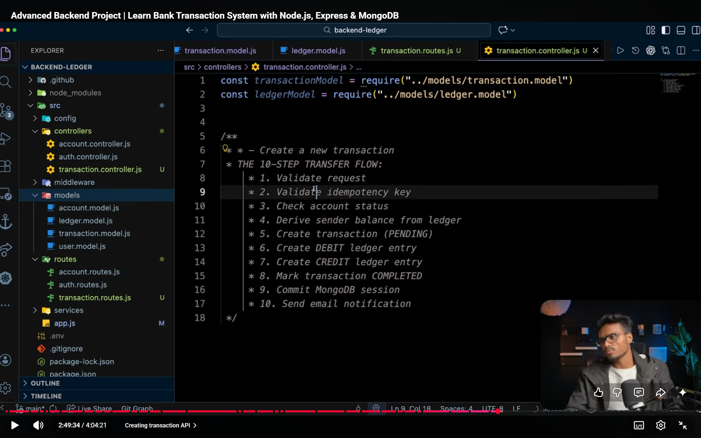

For a transaction from A to B of Amount=500:-

A:Balance=1000 B:Balance=2000

Steps:

1. A transaction is created : From-A, To-B, Idempotencykey=XYZ, Status: Pending
2. Ledger: Its like transaction history, so for a transaction 2 Ledgers are required one for A and other for B |Ledger A:Account=A,Amount=500,Type=Debit| Ledger B:Account=B,Amount=500,Type=Credit
3. Update transaction i.e. Status: Completed

IMP:Ledger is a single source of truth for a transaction so it shouldnt be modified or deleted
To calcaulate balance:-
We take the Ledger of the account and add all the credits and minus all the debits

Function for transaction in controller:-
STEPS: 
Also for transaction steps 5-8 should be completed at once(try&catch functions used) otherwise transaction will be failed so a session is created using mongoose
A session = a temporary workspace for database operations
Why Mongoose is used in transaction code?=>Mongoose provides built-in support for transactions using sessions, and integrates them cleanly with your models.
